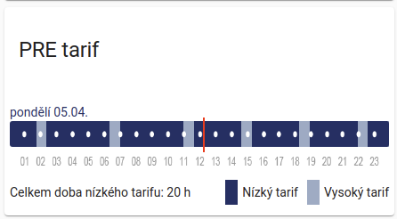

# PRE Distribuce - Home Assistant Sensor

[](https://github.com/custom-components/hacs)

This sensor is scraping data from https://www.predistribuce.cz/cs/potrebuji-zaridit/zakaznici/stav-hdo/. Put id of receiver command (see contract with PRE CZ or your energy meter) in configuration.yaml

This sensor always show
- current state of HDO
- HTML to render schedule bar
- time to reach low tariff or time needed to wait for low tarrif

optionally also
-  if a an applience (e.g. washing machine) can be run now to finish under low tariff

> Note: Are you customer of CEZ? Look here: https://github.com/zigul/HomeAssistant-CEZdistribuce

### Installation

Copy this folder to `<config_dir>/custom_components/predistribuce/`.

Add the following to your `configuration.yaml` file:

```yaml
# Example configuration.yaml entry for showing current HDO state and HTML for rendering a time schedule
binary_sensor:
  platform: predistribuce
  name: nocni proud
  receiver_command_id: 605
```

```yaml
# entry as above + extra binary sensors that show if a an applience (e.g. washing machine) can be run now to finish under low tariff
binary_sensor:
  - platform: predistribuce
    receiver_command_id: 605
    periods:
      - name: HDO Pračka
        minutes: 30
      - name: HDO Myčka
        minutes: 150
```

### PRE Schedule Bar
You can display visually low/high tarrif overview throughout the day.



Prerequisite is to install [Lovelace Html Card](https://github.com/PiotrMachowski/Home-Assistant-Lovelace-HTML-Jinja2-Template-card), ideally from HACS.
Once installed, create a new Lovelace card manually. Paste following content inside:
```
type: 'custom:html-card'
title: PRE tarif
content: |
  [[binary_sensor.hdo_aktualne.attributes.html_values]]

```
Do not forget to replace ```hdo_aktualne``` by your entity name.


